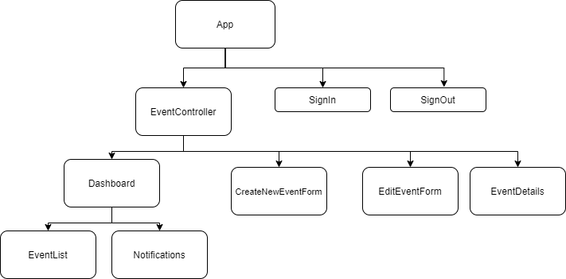

# _Event Planner_

<!-- #### _A React Redux application for kombucha store to track their kegs._  -->

#### _September 21, 2020 | Fatma C. Dogan_

## Description


### Component Diagram



## Specification user stories:
* A user should be able to create, update and delete an event. All events should be stored in the database.
* A user should be able to fill out and submit events. Event results should be submitted to the database. (An event result can be associated to a event by mimicking a one-to-many relationship.)
* A user should be able to sign up, sign in, and sign out.
* A user should have their own dashboard which lists the events they've created.


## Setup/Installation Requirements

#### Node install

###### For macOS:
_If Homebrew is not installed on your computer already, then install Homebrew by entering the following two commands in Terminal:_
* $ /usr/bin/ruby -e "$(curl -fsSL https://raw.githubusercontent.com/Homebrew/install/master/install)"
* $ echo 'export PATH=/usr/local/bin:$PATH' >> ~/.bash_profile

_Install Git with the following command:_
* $ brew install git

_Next, install Node.js by entering the following command in Terminal:_
* $ brew install node

###### For Windows:
_Please visit the [Node.js website](https://nodejs.org/en/download/) for installation instructions._

#### Install this application

_Clone this repository via Terminal using the following commands:_
```
cd desktop
git clone https://github.com/fc-dogan/Taproom-Redux
cd Taproom-Redux
```

_Next, install npm at the project's root directory, and start the server:_
```
npm install
npm start
```

_If everything is correct, the localhost site should open automatically_

_View the contents of this project by opening in VSCode:_
```
code .
```


## Technologies Used

* _React_
* _Redux_
* _Jest_
* _JavaScript_
* _WebPack_
* _CSS_
* _Git_

### License

*This webpage is licensed under the MIT license.*

Copyright &copy; 2020 **_Fatma C. Dogan_**